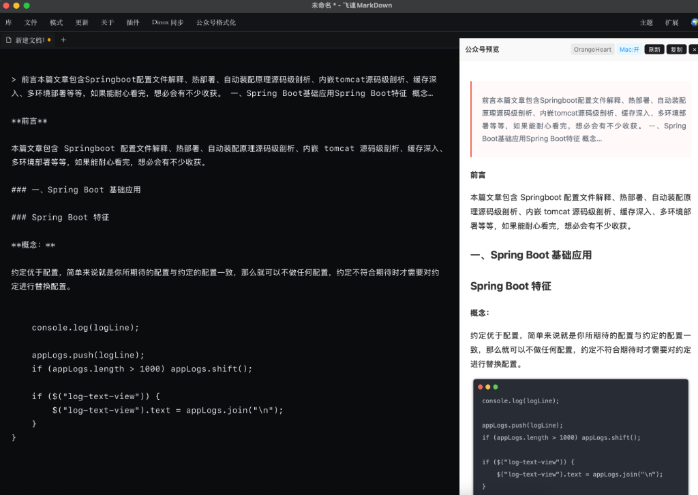

# flyMD Wechat Formatter Plugin

这是一个为 [flyMD](https://flymd.app) 开发的扩展插件，用于将 Markdown 内容转换为适配微信公众号的美化格式。
核心渲染引擎移植自优秀的 [文颜 (WenYan)](https://github.com/caol64/wenyan) 项目。

## 功能特性

- **一键格式化**：将 Markdown 转换为微信公众号格式并复制到剪贴板
- **多主题支持**：内置 8 款精美主题（Default, OrangeHeart, Rainbow 等）
- **代码高亮**：支持多种代码配色方案（GitHub, Dracula, Atom One 等）
- **Mac 风格代码块**：支持开启/关闭 Mac 窗口风格的代码块装饰

## 安装方法

1. 点击菜单栏「扩展」按钮
2. 输入：`gerrampard/flymd-wenyan-plugin`
3. 点击「安装」

## 使用方法

1. 在编辑器中编写 Markdown 内容
2. 点击顶部菜单栏的 `公众号格式化`
3. 开启预览窗口，选择主题和其他设置，选择 `复制`
4. 切换到微信公众号后台编辑器，粘贴即可

## 效果预览

## 鸣谢

- [flyMD](https://flymd.app) - 优秀的 Markdown 编辑器
- [文颜 (WenYan)](https://github.com/caol64/wenyan) - 本插件的核心排版引擎
